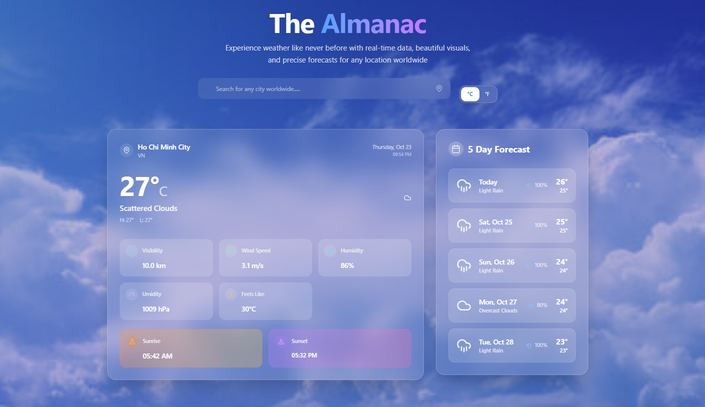

# React Weather Forecast Web
- This project is a simple Weather Web Application built with React + Vite, providing real-time weather information and a 5-day forecast using the OpenWeatherMap API.
- It demonstrates how to integrate external APIs, manage asynchronous data, and build a responsive, user-friendly interface.

## Features
- Search weather by **city name**
- Display **temperature, humidity, umidity, wind speed,...**
- Show **5-day weather forecast**
- Support for **current location detection**
- **Celsius / Fahrenheit** unit toggle
- **Responsive UI** for both desktop and mobile
  
## Screenshots

## Installation
1. Clone the repository: `git clone <repository-url>`
2. Navigate into the directory: `cd weather-web`
3. Install dependencies: `npm install`

## Usage
1. Run the application: `npm run dev`
2. Open your browser and navigate to: `http://localhost:5173`
